# Mentiv – Roadmap-First Learning Platform 

Mentiv is a next-generation Learning Management System (LMS) designed to solve one of the most overlooked problems in online education:

❝ Learners don’t know what to study, in what order, and why ❞

Unlike traditional LMS platforms that focus only on course completion, Mentiv introduces structured learning roadmaps that guide students step-by-step through a logical, industry-aligned learning journey.

## Why Mentiv?
Most learners fail not because of lack of resources, but because of:

- Information overload

- No clear learning sequence

- No visibility into “what comes next”

- Random course consumption without direction

Mentiv transforms learning from random consumption into a guided journey.

### **Problem Statement**

The Learning Overload Crisis:

Student Journey Without Mentiv:  
Confused 😕 → Random Course Selection → No Progress → Quit 😞

80% students don't know:

→ What to learn for their target role

→ Correct sequence (HTML → React → Node.js?)

→ How courses connect to career goals

### **Solution Statement**

Mentiv Roadmap Journey:

Select Goal → Follow Roadmap → Complete Curated Courses → Job Ready ✅

Mentiv's Unique Approach:

- Visual Roadmaps for popular roles (Full-Stack, DSA, AI/ML, DevOps, etc.)

- Step-by-step guidance - "Learn X → then Y → then Z"

- Curated course recommendations for each roadmap step

- Progress visualization across the entire roadmap

- No guesswork - students always know "what's next"

## Key Features

🧭 Roadmap-based learning paths (core USP)

🎓 Secure student & instructor roles

💳 Stripe-based course enrollment

🔐 JWT authentication & RBAC

📊 Progress tracking 

📱 Fully responsive UI

## Screenshots
| 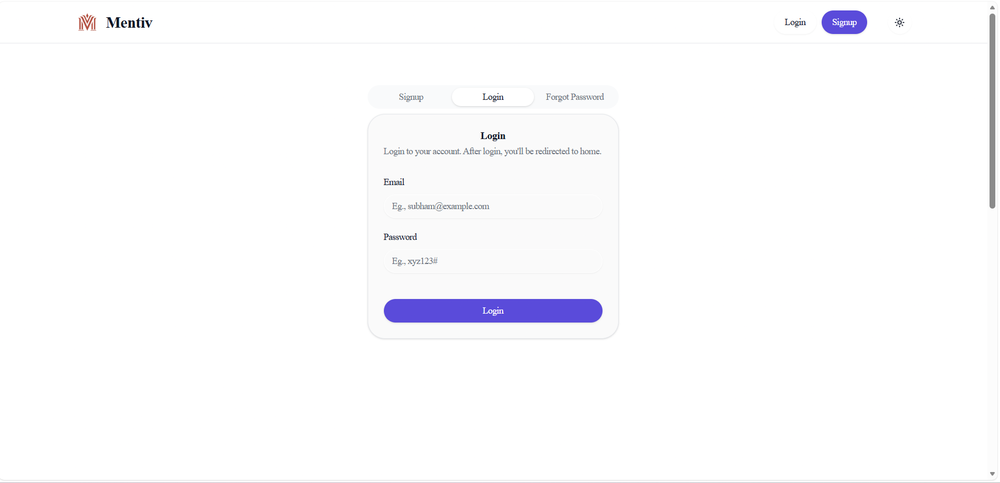 |
| 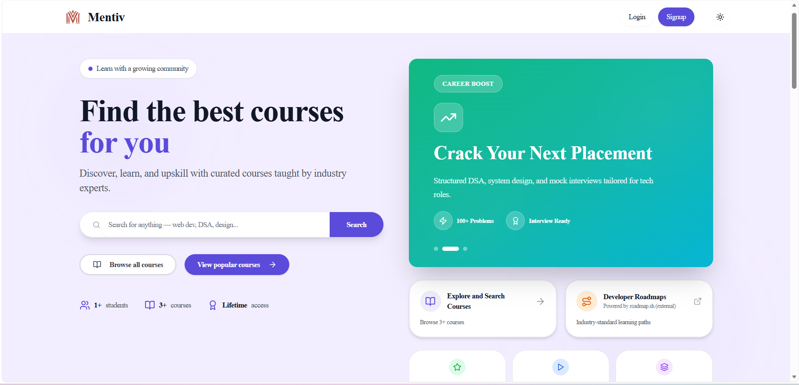 |
| 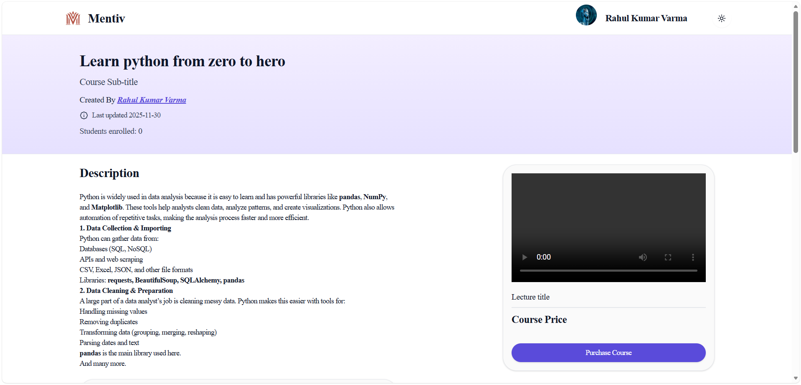 |
| 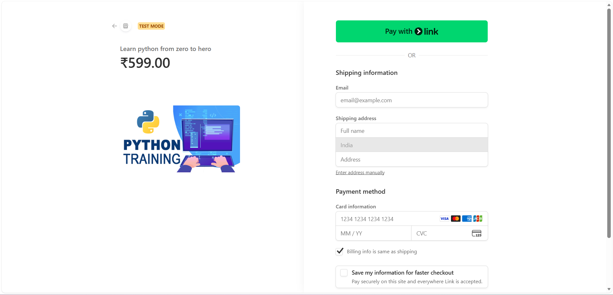 |
| 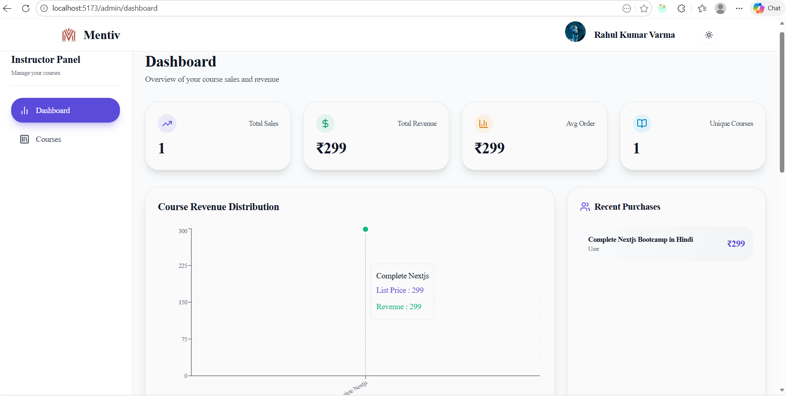 |
|  |
| 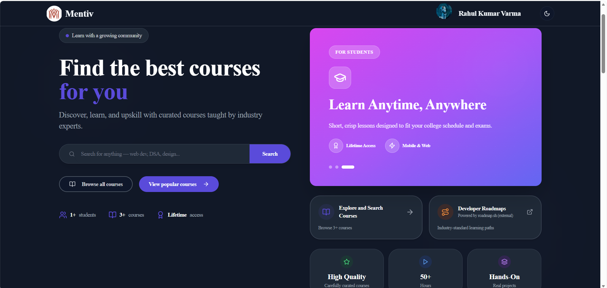 |
| 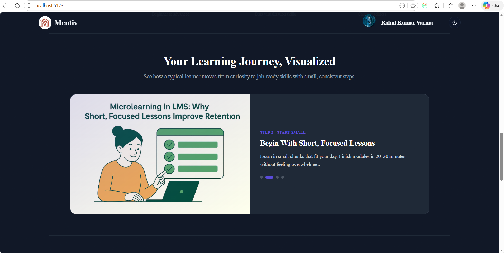 |
| 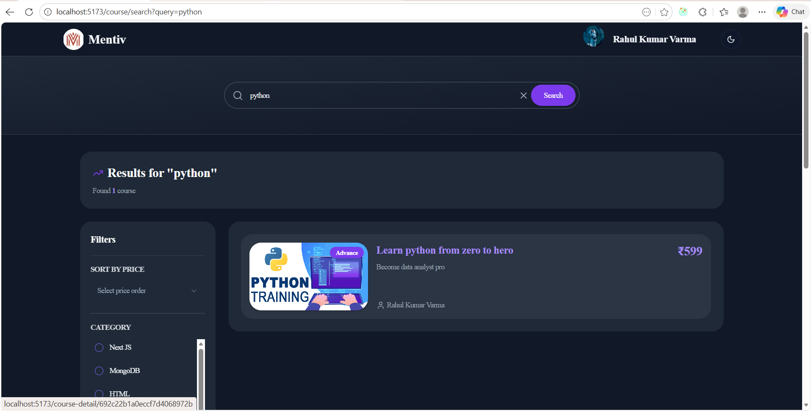 |
| 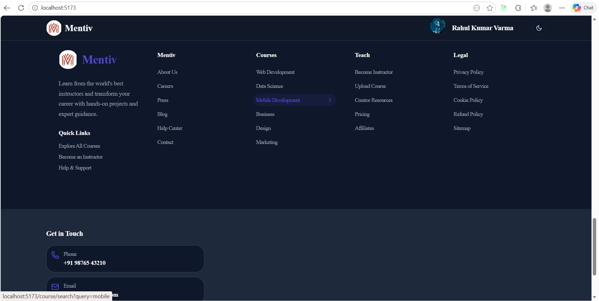 |
|  |
| 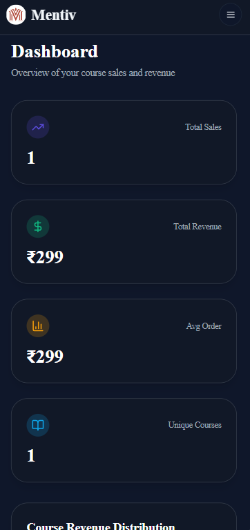 |
| 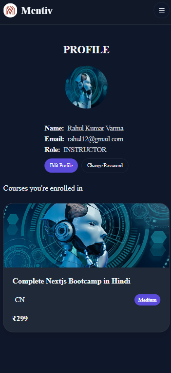 |

## Project Structure
Mentiv/
├── client/ # React frontend
│ ├── src/
│ │ ├── components/
│ │ ├── pages/
│ │ ├── app/
│ │ └── main.jsx
| | |__ ....
│ └── public/
│
└── server/ # Node.js backend
├── controllers/
├── models/
├── routes/
├── middleware/
├── utils/
└── index.js

## Getting Started
### Prerequisites
- Node.js 18+

- MongoDB (local or Atlas)

- npm/yarn
### Frontend Setup
1. Clone the repository
git clone https://github.com/Subham62/Mentiv-OnlineLearningPlatform.git

2. Navigate to the client directory
cd client 

3. Create a .env file in the client directory

4. Install dependencies
npm Install

5. Run the client
npm run dev

### Backend Setup
1. Navigate to the server directory
cd server 

2. Create a .env file in the server directory

3. Install dependencies
npm Install

4. Run the server
npm run dev

## Technologies Used
### Frontend

- React.js

- Redux Toolkit & RTK Query

- Tailwind CSS
- HTML
- Javascript

### Backend

- Node.js

- Express.js

- MongoDB & Mongoose

- JWT Authentication

- Stripe Payment Gateway

## Contribution Guidelines
We welcome contributions to enhance and improve the application.
If you have ideas or improvements, feel free to submit a **pull request** following standard contribution practices.

## Feedback and Issues
If you encounter any issues or have feedback, please open an issue on the *GitHub* repository.
Your input helps improve Mentiv with every update.

⭐ If roadmap-driven learning makes sense to you, consider starring this repository.