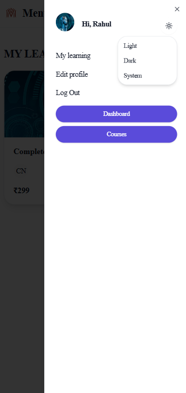
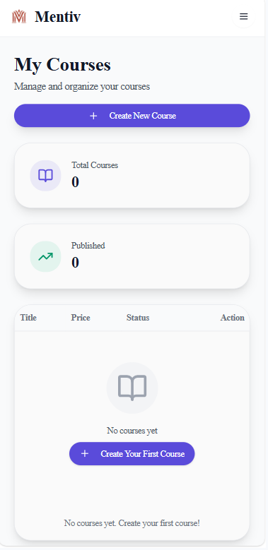

# Mentiv – Roadmap-First Learning Platform 

Mentiv is a next-generation Learning Management System (LMS) designed to solve one of the most overlooked problems in online education:

*❝ Learners don’t know what to study, in what order, and why ❞*

Unlike traditional LMS platforms that focus only on course completion, Mentiv introduces structured learning roadmaps that guide students step-by-step through a logical, industry-aligned learning journey.

## Why Mentiv?
Most learners fail not because of lack of resources, but because of:

- Information overload

- No clear learning sequence

- No visibility into “what comes next”

- Random course consumption without direction

Mentiv transforms learning from random consumption into a guided journey.

## **Problem Statement**

The Learning Overload Crisis:
```
Student Journey Without Mentiv:  
Confused 😕 → Random Course Selection → No Progress → Quit 😞
```
80% students don't know:

→ What to learn for their target role

→ Correct sequence (HTML → React → Node.js?)

→ How courses connect to career goals

## **Solution Statement**
```
Mentiv Roadmap Journey:
Select Goal → Follow Roadmap → Complete Curated Courses → Job Ready ✅
```
Mentiv's Unique Approach:

- Visual Roadmaps for popular roles (Full-Stack, DSA, AI/ML, DevOps, etc.)

- Step-by-step guidance - "Learn X → then Y → then Z"

- Search curated course for each roadmap step

- Progress visualization 

- No guesswork - students always know "what's next"

## Key Features

🧭 Roadmap-based learning paths (core USP)

🎓 Secure student & instructor roles

💳 Stripe-based course enrollment

🔐 JWT authentication 

📊 Progress tracking 

📱 Fully responsive UI

## Screenshots






## Project Structure
```
Mentiv/
├── client/                              # React frontend application
│   ├── src/
│   │   ├── assets/                      # Images, logos, and static assets
│   │   ├── app/                         # Redux app setup
│   │   │   ├── store.js                 # Redux store configuration
│   │   │   └── rootReducer.js           # Combined feature reducers
│   │   ├── components/                  # Reusable UI components
│   │   ├── config/                      # Application constants & configs
│   │   │   └── courseCategories.jsx     # Course IDs and labels (constants)
│   │   ├── features/                    # Feature-based state & API logic
│   │   │   ├── api/                     # API services (RTK Query)
│   │   │   └── authSlice.js             # Authentication state slice
│   │   ├── layout/                      # Shared application layouts
│   │   │   └── MainLayout.jsx           # Primary app layout
│   │   ├── lib/                         # Utility functions & helpers
│   │   │   └── utils.js                 # Common utility methods
│   │   ├── pages/                       # Route-level pages
│   │   │   ├── admin/                   # Admin & instructor pages
│   │   │   └── student/                 # Student-facing pages
│   │   ├── App.jsx                      # Root React component
│   │   └── main.jsx                     # React application entry point
│   └── public/                          # Public static files
│
└── server/                              # Node.js backend service
    ├── database/                        # Database configuration
    ├── uploads/                         # Uploaded assets (course thumbnails, files)
    ├── controllers/                     # Request handlers
    ├── models/                          # MongoDB schemas
    ├── routes/                          # API route definitions
    ├── middleware/                      # Authentication handling
    ├── utils/                           # Backend utility helpers
    └── index.js                         # Backend application entry point
```
## Getting Started
### Prerequisites
- Node.js 18+

- MongoDB (local or Atlas)

- npm
### Frontend Setup
1. Clone the repository:
```bash
git clone https://github.com/Subham62/Mentiv-OnlineLearningPlatform.git
```
2. Navigate to the client directory:
```bash
cd client 
```
3. Create a ```.env``` file in the client directory

4. Install dependencies:
```bash
npm Install
```
5. Run the client:
```bash
npm run dev
```
### Backend Setup
1. Navigate to the server directory:
```bash
cd server 
```
2. Create a ```.env``` file in the server directory

3. Install dependencies:
```bash
npm Install
```
4. Run the server:
```bash
npm run dev
```
## Technologies Used
### Frontend

- React.js

- Redux Toolkit & RTK Query

- Tailwind CSS

- HTML

- Javascript

### Backend

- Node.js

- Express.js

- MongoDB & Mongoose

- JWT Authentication

- Stripe Payment Gateway

## Contribution Guidelines
We welcome contributions to enhance and improve the application.
If you have ideas or improvements, feel free to submit a **pull request** following standard contribution practices.

## Feedback and Issues
If you encounter any issues or have feedback, please open an issue on the *GitHub* repository.
Your input helps improve Mentiv with every update.

⭐ If roadmap-driven learning makes sense to you, consider starring this repository.

## Acknowledgments

- React and the open-source community for building a flexible frontend ecosystem
- Redux Toolkit for simplifying global state management
- Node.js and Express.js for a robust backend foundation
- MongoDB for flexible and scalable data storage
- Stripe for secure and developer-friendly payment processing
